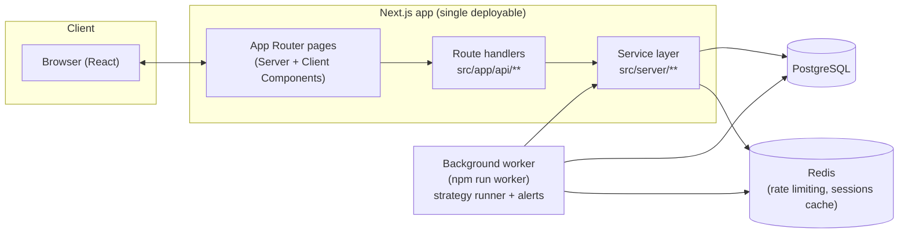
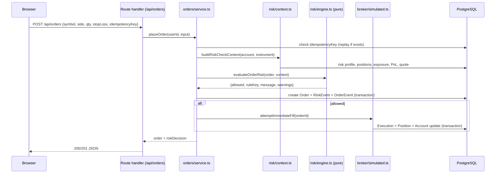
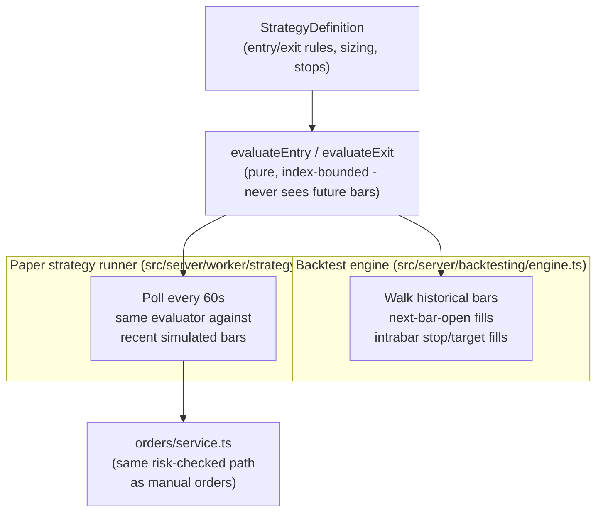
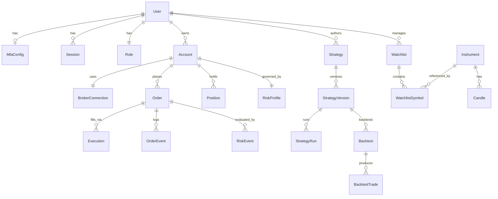

# Architecture

## Overview

Probable Disco is a single Next.js application (App Router) that serves both the UI (React
Server/Client Components) and the API (Route Handlers under `src/app/api/**`), backed by
PostgreSQL (via Prisma) and Redis. A separate long-running Node process (`npm run worker`) runs
the paper strategy runner and alert evaluator on an interval. Everything - market data, the
broker, order matching - is simulated in-process; nothing here talks to a real exchange.



## Request flow: placing an order



The risk engine (`src/server/risk/engine.ts`) is a pure function with no I/O, so it's unit
tested directly with hand-built contexts (see `tests/unit/risk-engine.test.ts`) - the only I/O
is in `risk/context.ts`, which assembles its input from the database.

## Strategy execution: one evaluator, two runners

Both the backtester and the live paper strategy runner call the exact same condition evaluator
(`src/server/strategy/evaluator.ts`), so a strategy's backtested behavior and its live paper
behavior can never silently diverge:



## Market data

`src/server/market-data/provider.ts` defines a `MarketDataProvider` interface
(`getQuote`, `getCandles`) with one implementation today, `SimulatedMarketDataProvider`. A real
(licensed) provider would implement the same interface and be registered in
`getMarketDataProvider()` - no other code depends on the simulated provider's internals.

- **Candles** are a seeded random walk (mulberry32 PRNG + clamped Box-Muller shocks), always
  replayed forward from a fixed epoch, so the same symbol produces the same historical path on
  every run - important for reproducible backtests. Daily candles are cached in Postgres on
  first request; intraday candles (M1/M5/M15/H1) are a Brownian bridge anchored to the cached
  daily candle, bounded to a 30-day window.
- **Live quotes** are computed on demand from the day's cached candle plus the current
  America/New_York session state (DST-aware via `Intl`) - no per-tick data is persisted, to avoid
  unbounded row growth in a table not designed for high-frequency retention.

## Data model

See `prisma/schema.prisma` for the full schema. The core entities:



## Why these choices

- **Custom auth instead of next-auth**: user-controlled session revocation needed a DB-backed
  session table, which doesn't fit next-auth's credentials-provider model (JWT-only) cleanly.
- **Prisma 7 driver adapters**: Prisma 7 requires an explicit driver adapter
  (`@prisma/adapter-pg`) - there's no more implicit query-engine-binary connection from a bare
  `DATABASE_URL`.
- **TypeScript 6.0.3 / ESLint 9.39.5, not the newest majors**: `typescript-eslint` (used by
  `eslint-config-next`) doesn't yet support TypeScript 7 or the ESLint 10 Linter API - confirmed
  by hard runtime failures during setup, not guesswork. Re-evaluate once upstream catches up.
- **Long-only in v1**: matches the documented product scope (short selling excluded pending
  proper borrow-availability modeling). Enforced in both the portfolio accounting layer and the
  risk engine.
- **No partial fills simulated**: the matching engine fills a triggered order's entire remaining
  quantity at once. The schema supports partial fills (`filledQuantity`, `PARTIALLY_FILLED`) for
  when order-book-depth simulation is added.
- **A poll loop, not BullMQ, for the strategy runner**: the workload is "re-evaluate every active
  run every N seconds," which a plain `setInterval` expresses more simply than a job queue. BullMQ
  is still a dependency and a reasonable choice if discrete one-off background jobs (e.g. bulk
  data imports) are added later.

## Directory guide

```
src/
  app/                  Next.js routes (pages under (auth)/(app), API under api/**)
  components/           UI kit (components/ui) and trading-specific components
  hooks/                Client-side TanStack Query hooks
  lib/                  Framework-agnostic utilities (env, db, redis, indicators, crypto, ...)
  server/               Business logic, organized by domain (auth, orders, risk, strategy, ...)
  generated/prisma/     Generated Prisma client (not hand-edited)
prisma/                 Schema, migrations, seed script
tests/
  unit/                 Pure-function tests (no DB)
  integration/          Tests against the real Postgres/Redis stack
  e2e/                  Playwright browser tests
docs/                   Threat model, compliance checklist, deployment, troubleshooting
```
